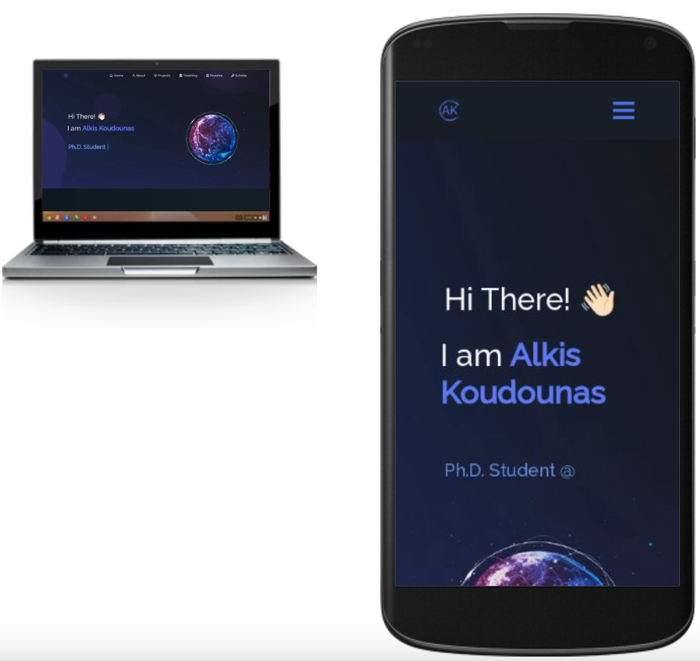
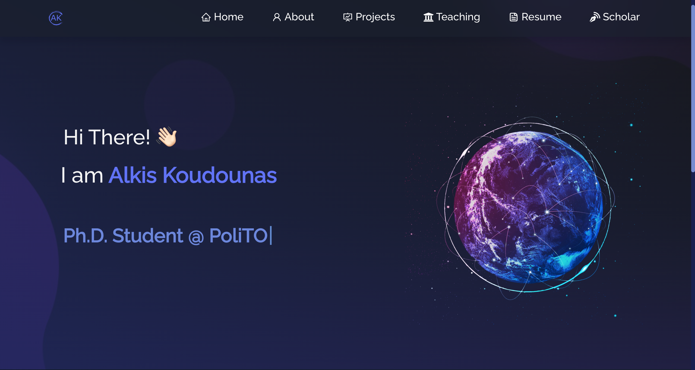
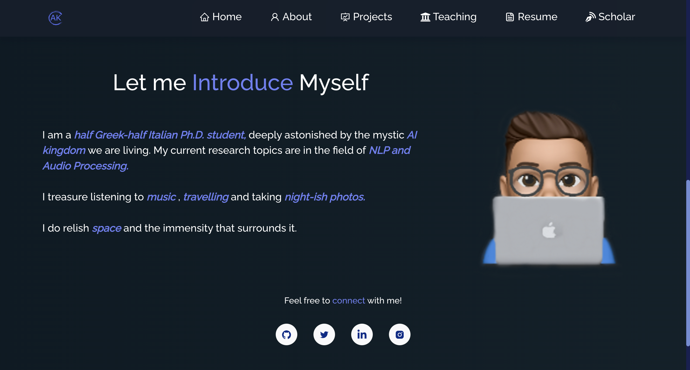

# ALKIS KOUDOUNAS | PORTFOLIO

  

This is my personal portfolio [koudounasalkis.github.io](https://koudounasalkis.github.io/).

Here I shortly describe myself, what I have done and what I currently do.  
You can also find my hobbies, my technical skills, my latest projects, and the courses I am teaching at.

  

  

You can finally look at my [Resume](https://raw.githubusercontent.com/koudounasalkis/koudounasalkis.github.io/f49a7579f13f5ae8ee0b7e6ecee0fce55523605b/static/media/Alkis_Koudounas_CV.03fcd843053db3909486.pdf).

Thanks [Soumyajit](https://github.com/soumyajit4419) for the amazing template!

